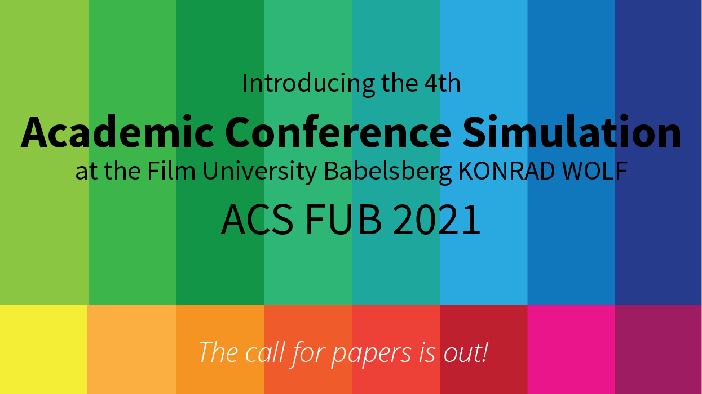

# Goals

The overall goal of the conference simulation is to apply the topics of the lecture Academic Methodologies. Specifically, students  

* write a short research paper,
* experience a typical process for submitting a paper, and
* get to know the review process by writing and receiving reviews.

# Setup

The conference simulation includes

* the submission of a (short-) paper,
* the review of two papers,
* the receiving of three reviews for your paper,
* the presentation of your paper in front of your peers, and
* the best paper award.

The [EasyChair Conference Management System](https://easychair.org/) is used for the paper and review submissions. You will need to create an account for the system.

## Important Dates

All deadlines (20:00 GMT) are hard. Late submissions are not accepted.

* 30.08.21: Abstract Due
* 02.09.21: Paper Due
* 07.09.21: Review Start
* 28.09.21: Review Due
* 30.09.21: Author Notification
* October 21 (tba): Camera-ready Paper Due
* October 21 (tba): Conference presentation

## Paper Submission

* Submissions will be made electronically through the [EasyChair submission system](https://easychair.org/conferences/?conf=acsfub2020).
* Submissions are anonymous. DO NOT INCLUDE YOUR NAME IN THE SUBMITTED PAPER PDF.
* Submissions are only accepted as pdf from the given [LaTeX template](acsfubPublStyle.zip).
    * The template is a stripped down version of the original conference template of the [Eurographics](https://conferences.eg.org/eg2021/) conference, with this [original submission template](egPublStyle-EG-full-star-short-edu-tut-posters-2019.zip)). This specific template is fairly complex but it will be a good (and realistic) exercise for you to work with this template.
    * **If you have no experience with working with LaTeX make sure to plan in enough time to get accustomed to the system.**
    * If you know LaTeX feel free to add packages and commands to the template. However make sure that you always adhere to the predefined layout. If in doubt, the layout is explicitly listed in [Eurographics Author’s guidelines](egPublStyle-EG-full-star-short-edu-tut-posters-2019.zip).
    * Here can find an Eurographics [exemplary short paper](https://www.dfki.de/fileadmin/user_upload/import/10356_009-012.pdf) (randomly chosen).
* The abstract must have <= 1000 characters.
* The paper 
    * must be 4-6 pages in length (without references),
    * must be in English,
    * adhere to an academic format (e.g. introduction, contributions, related work, problem statement, solution, future work), and 
    * should make an academic contribution as much as possible (but don't stress about this).

## Review Submission

* Reviews will be made electronically through the EasyChair system. You will be notified by email once the review forms are available to you and you can start the review.
* You will write two reviews and receive three. All reviews are anonymous.
* You should evaluate a paper based on the content but also on its form and language.
* You are required to use the [review template](review_template_preview.txt) given in the EasyChair system.
    * You will give grades from 0 to 9 and written comments.
    * Categories
        * Originality, Novelty
        * Clarity of presentation
        * Technical soundness
        * Importance, utility
        * Could this approach be implemented by a graduate student?
        * Completeness of References
        * Best Paper Award
        * Not all categories are easily applicable to all papers, but try to make use of these categories as best as possible.

The reviews might give revisions and these must be considered in the final camera-ready version. Only the camera-ready version of your paper includes your name.

## Conference Presentation

* October 15-16th, 10 a.m.-5 p.m.
* 15 min formal presentation
* 5-10 min discussion

# Evaluation

There will be a grade. The grade is computed as follows:

* 60% for the paper
* 20% for the presentation
* 20% for the reviews

## Grading

The grading criteria for the paper are based on

* the research idea,
* a coherence to an academic format, and
* the form of presentation.

The grading criteria for the review are based on

* suitability and quality of the comments, and
* a reasonable quantity.

The grading criteria for the presentation are based on

* the communication of the research idea,
* a coherence to an academic format, and
* the form of presentation.
